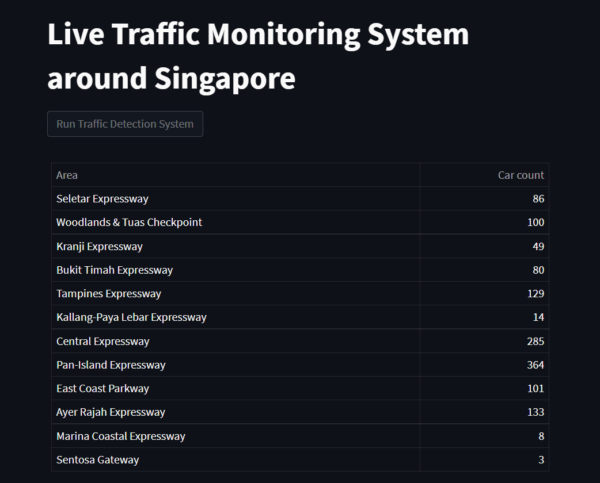
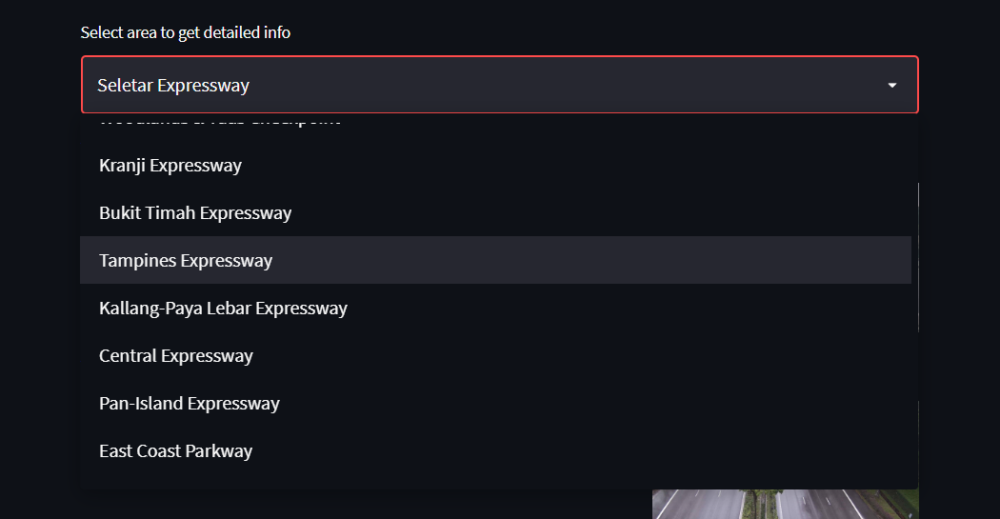

# Live Traffic Monitoring Around Singapore

This project gives us near real time monitoring capabilities of Traffic around Singapore.

We extract cctv images around singapore from https://onemotoring.lta.gov.sg/content/onemotoring/home/driving/traffic_information/traffic-cameras.html which are update frequently (every 5 to 10 mins) for different area and then we run these images through YOLO V3 to detect cars with good accuracy

To read more about YOLO you can visit https://pjreddie.com/darknet/yolo/

You can find the different areas and its code in areas.json
```json
{
    "sle" : "Seletar Expressway",
    "woodlands": "Woodlands & Tuas Checkpoint",
    "kje": "Kranji Expressway",
    "bke": "Bukit Timah Expressway",
    "tpe": "Tampines Expressway",
    "kpe": "Kallang-Paya Lebar Expressway",
    "cte": "Central Expressway",
    "pie": "Pan-Island Expressway",
    "ecp": "East Coast Parkway",
    "aye": "Ayer Rajah Expressway",
    "mce": "Marina Coastal Expressway",
    "stg": "Sentosa Gateway"
}
```


We use streamlit (web app) for live monitoring our system and are able to monitor the number of cars at different locations in an area

How to run:
clone this repo
```
git clone https://github.com/vedantmahalle21/live-traffic-monitoring.git 
cd live-traffic-monitoring
wget https://pjreddie.com/media/files/yolov3.weights -P yolo/ #download weights for yolo V3.
pip3 install -r requirements.txt
streamlit run main.py
```

Goto http://localhost:8501 

wait for screen to load and click on "Run Traffic Detection System" for live run of the program and wait till it completes

if you see any error on the webpage just click on "Run Traffic Detection System" button and let it run again

You can see the traffic data around singapore 


You can also select a particular area from dropdown 



And you can view the data and traffic images for locations in the area


