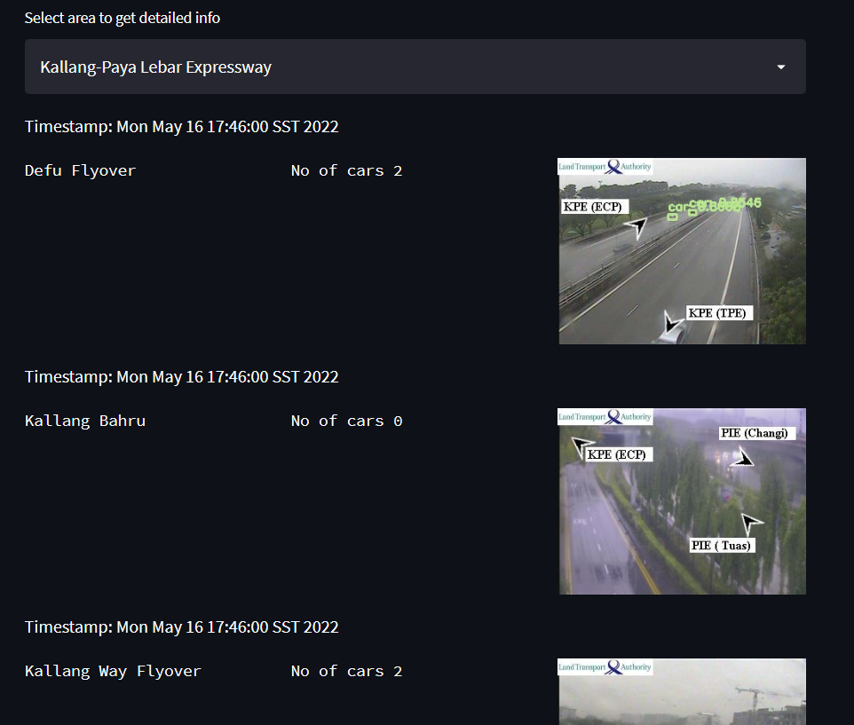

# Live Traffic Monitoring Around Singapore

We extract near real time cctv images around singapore from https://onemotoring.lta.gov.sg/content/onemotoring/home/driving/traffic_information/traffic-cameras.html for different area

You can find the different areas and its code in areas.json

We use streamlit for live monitoring our system and are able to monitor the number of cars at different locations in an area

How to run:
clone this repo
```
git clone https://github.com/vedantmahalle21/live-traffic-monitoring.git
wget https://pjreddie.com/media/files/yolov3.weights yolo/
pip3 install -r requirements.txt
streamlit run main.py
```

Goto http://localhost:8501 

wait for screen to load and click on "Run Traffic Detection System" for live run of the program and wait till it completes

You can see the traffic data around singapore 


You can also select a particular area from dropdown 


And you can view the data and traffic images for locations in the area

